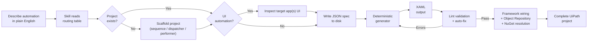

<p align="center">
  
</p>

AI skills that turn natural language into production-quality UiPath Studio projects — powered by deterministic Python generators, real Studio-exported templates, and a validation layer tuned to catch LLM hallucination patterns. No hallucinated XAML. No guessed selectors. Every `.xaml` file opens cleanly in UiPath Studio.

## The problem

LLMs are bad at generating UiPath code. The XAML they produce is typically invalid — wrong namespaces, hallucinated activity names, broken selectors, missing ViewState blocks, incompatible NuGet versions. Most of it won't even open in Studio.

**uipath-ai-skills** closes that gap. The agent writes JSON specs; the toolchain emits valid XAML, catches hallucination patterns before they reach your project, and wires the framework for you — so what usually takes days of Studio cleanup becomes minutes of review.

---

## Complete walkthrough

[](https://youtu.be/0JjiM8sGP08)

End-to-end walkthrough — setup, how to use the skills, and what production output looks like in UiPath Studio.

---

## What you can build

| Automation type | Description | Recommended project |
|---|---|---|
| **Web form filling** | Browser-based data entry with real selectors from Playwright inspection | Sequence or REFramework |
| **Queue dispatching** | Read data sources (Excel, DB, API) and populate Orchestrator queues | REFramework Dispatcher |
| **Queue processing** | Process queue items with retry logic, exception handling, and status tracking | REFramework Performer |
| **API integrations** | HTTP requests with OAuth, retry policies, JSON parsing, credential management | Sequence |
| **Excel processing** | Read, filter, transform, and write Excel data with LINQ expressions | Sequence |
| **PDF extraction** | Extract text from PDFs using native parsing or OCR | Sequence |
| **Email automation** | IMAP retrieval, attachment processing, and sending via Integration Service | Sequence |
| **Desktop automation** | Win32/WPF/WinForms app automation with PowerShell-inspected selectors | Sequence or REFramework |
| **Multi-app orchestration** | Processes spanning multiple web and desktop applications | REFramework Performer |
| **Human-in-the-loop tasks** | Form approvals, external system handoff, recovery workflows | Any (uipath-tasks plugin) |

---

## Quick start

> [!IMPORTANT]
> **Plugin Layout:** Plugins (like `uipath-tasks`) must be installed as sibling directories to `uipath-core`. The runtime loader scans sibling folders for extensions; moving them to a different nested structure will break discovery.

> [!NOTE]
> **PowerShell:** While the core generators are cross-platform, desktop selector generation via `inspect-ui-tree.ps1` requires PowerShell on a Windows environment.

Adding the skills to your environment is super simple:

<details open>
<summary><strong>Claude Code</strong></summary>

```
/plugin marketplace add marcelocruzrpa/uipath-ai-skills
/plugin install uipath-core@uipath-ai-skills
/plugin install uipath-tasks@uipath-ai-skills
```

Verify by asking Claude *"List my available skills"* — you should see both `uipath-core` and `uipath-tasks`.

</details>

<details>
<summary><strong>Codex CLI</strong></summary>

```bash
git clone https://github.com/marcelocruzrpa/uipath-ai-skills.git
mkdir -p .codex/skills
cp -r uipath-ai-skills/uipath-core  .codex/skills/uipath-core
cp -r uipath-ai-skills/uipath-tasks .codex/skills/uipath-tasks
codex
```

Or install globally:

```bash
cp -r uipath-ai-skills/uipath-core  ~/.codex/skills/uipath-core
cp -r uipath-ai-skills/uipath-tasks ~/.codex/skills/uipath-tasks
```

If Codex truncates the skill, raise the instruction limit in `~/.codex/config.toml`:

```toml
project_doc_max_bytes = 131072  # 128 KB
```

</details>

<details>
<summary><strong>Manual install</strong></summary>

If you're using a different agent or vendoring the plugins into an existing project, clone and copy:

```bash
git clone https://github.com/marcelocruzrpa/uipath-ai-skills.git

# Optional: install openpyxl for Config.xlsx management
pip install "openpyxl>=3.1.0"
```

No other dependencies required — all core scripts use Python stdlib.

Copy into a Claude Code project:

```bash
mkdir -p <your-project>/.claude/skills
cp -r uipath-ai-skills/uipath-core  <your-project>/.claude/skills/
cp -r uipath-ai-skills/uipath-tasks <your-project>/.claude/skills/
```

Copy into a Codex CLI project:

```bash
mkdir -p <your-project>/.codex/skills
cp -r uipath-ai-skills/uipath-core  <your-project>/.codex/skills/
cp -r uipath-ai-skills/uipath-tasks <your-project>/.codex/skills/
```

</details>

### Using the skill

1. **Start in plan mode when your agent supports it.** In Claude Code, toggle plan mode with Shift+Tab before sending your prompt — the agent reads your **PDD (Process Definition Document)**, drafts a plan, and waits for your approval before touching files. Review the plan, tweak it if needed, then approve and let it execute.
2. **Name the skill in your prompt** to be sure it loads — e.g. *"Use `uipath-core` to scaffold a REFramework dispatcher for this PDD..."*. The skill also auto-loads when your prompt mentions UiPath, but naming it explicitly is the surest path. For human-in-the-loop or Tasks workflows, name `uipath-tasks`.
3. **Three ways to use it:**
   - **Build a project from a PDD** — point the agent at a PDD file and (optionally) tell it the architecture (sequence, dispatcher, or performer). It scaffolds the project, generates the workflows, inspects target apps for selectors, and validates the output.
   - **Update an existing project** — point it at an existing UiPath project and ask for a bug fix, a new workflow, or a small change. It reads the project structure, generates only the deltas, and re-validates.
   - **Refactor a legacy project into REFramework** — point it at an existing project built with flat structure or bad practices and ask for a wholesale rewrite. It reads the workflows, proposes a proper decomposition (launch / init / process / action files, Config.xlsx, Object Repository), and migrates the logic into the new shape. *Not battle-tested as the other two modes*

---

## How it works



The skill uses four layers to ensure valid output:

1. **Deterministic generators** — Python functions that produce structurally correct XAML for each activity type. The LLM writes a JSON spec (which LLMs handle well); generators handle the complex XML structure (which LLMs handle poorly). Every enum value, child element, namespace, and attribute is locked down.

2. **Studio-exported templates** — every generator is anchored to real XAML exported from UiPath Studio 24.10. Not documentation examples — actual working files.

3. **Lint validation** — rules that specifically target the hallucination patterns LLMs produce when generating UiPath XAML. Catches issues before you open Studio. Auto-fix is available for common issues.

4. **Framework wiring** — `modify_framework.py` wires `InvokeWorkflowFile` calls into framework files, injects variables, replaces scaffold markers, and chains UiElement arguments. `generate_object_repository.py` builds the `.objects/` tree from captured selectors. Both ensure the generated project is structurally complete.

---

## Available skills

| Skill | Status | Description |
|---|---|---|
| **[uipath-core](./uipath-core/)** | **Released** | XAML generation, REFramework scaffolding, selector generation, lint validation, plugin loader |
| **[uipath-tasks](./uipath-tasks/)** | **Released** | Form Tasks, External Tasks, and Task Management activities for human-in-the-loop, system-in-the-loop, and recovery workflows |
| uipath-sap-wingui | Planned | SAP GUI for Windows automation |
| uipath-du | Planned | Document Understanding — taxonomy, extraction, classification, and validation pipelines |

`uipath-core` is the required base. Additional skills are plugins that extend the core through `plugin_loader.py` — they register their own generators, lint rules, scaffold hooks, namespaces, and known activities, and the core engine auto-discovers them at runtime.

---

## Plugin architecture

uipath-ai-skills has two distinct extension surfaces — keep them straight when you're authoring or installing plugins.

**Marketplace manifest** — `.claude-plugin/marketplace.json`. Declares each plugin's name and skill path for Claude Code's `/plugin install` command. This is the install/discovery surface only.

**Runtime loader** — `uipath-core/scripts/plugin_loader.py`. At import time, scans every sibling directory of `uipath-core/` for an `extensions/__init__.py` package. Each plugin's `__init__.py` registers its contributions through the loader's API. Core scripts (`generate_workflow.py`, `validate_xaml`, `scaffold_project.py`, `resolve_nuget.py`, etc.) query the registries when they run.

A plugin can register:

- **Generators** — XAML emitters for new activity types
- **Lint rules** — validators that run as part of `validate_xaml`
- **Scaffold hooks** — `project.json` mutators that run after `scaffold_project.py` creates a project
- **Namespaces** — XML namespace bindings for plugin activities
- **Known / key activities** — IdRef and DisplayName requirements
- **Hallucination patterns** — common LLM error → corrected form mappings
- **Common packages** — NuGet packages picked up by `resolve_nuget.py --all`
- **Type mappings** — short type aliases for plugin types
- **Variable prefixes** — naming-convention hints for variables of plugin types
- **Battle-test graders** — automated grading functions for plugin-specific suites
- **Generator test specs** and **lint test fixtures** — regression coverage that the core test runner picks up automatically

### Writing your own plugin

The reference implementation is `uipath-tasks/extensions/__init__.py`. The minimal layout:

```
your-plugin/                          # sibling directory of uipath-core/
├── SKILL.md                          # skill routing table for the LLM
├── extensions/
│   ├── __init__.py                   # registers your contributions
│   ├── generators.py
│   └── lint_rules.py
├── references/                       # docs the LLM reads as context
└── assets/
    ├── generator-snapshots/          # golden XAML for your generators
    └── lint-test-cases/              # bad/good XAML for your lint rules
```

A typical `extensions/__init__.py`:

```python
from plugin_loader import (
    register_generator, register_lint, register_namespace,
    register_known_activities,
)

from .generators import gen_my_activity
from .lint_rules import lint_my_rules

register_namespace("mypfx", "clr-namespace:My.Namespace;assembly=My.Assembly")
register_generator("my_activity", gen_my_activity, display_name="MyActivity")
register_lint(lint_my_rules, "lint_my_plugin")
register_known_activities("MyActivity")
```

To make it installable through Claude Code, add an entry to `.claude-plugin/marketplace.json`.

---

## Built-in best practices

The skill doesn't just generate valid XAML — it enforces the patterns that experienced UiPath developers apply manually:

- **Modular decomposition** — one workflow per action, organized in `Workflows/<AppName>/` subfolders. Main.xaml orchestrates via `InvokeWorkflowFile` and never contains business logic directly.
- **Config-driven everything** — URLs, credential asset names, queue names, and application settings live in Config.xlsx. Nothing is hardcoded in workflows.
- **Credential security** — passwords are always `SecureString`, never `String`. `GetRobotCredential` is called inside the Launch workflow at minimal scope — never in InitAllApplications, never passed as arguments between workflows.
- **REFramework architectural discipline** — InitAllApplications opens all apps and gets them to a ready state. Process.xaml and action workflows are attach-only (`OpenMode="Never"`). SetTransactionStatus is never modified. Login stays inside `AppName_Launch.xaml`.
- **Browser discipline** — incognito mode by default, one browser instance per web app, no logout actions (close the browser instead). Navigates by URL (`NGoToUrl` with Config-driven URLs) instead of fragile UI click-paths whenever the target page has a direct URL.
- **Selector standards** — strict selectors over fuzzy, single-quoted attributes, dynamic selectors via Config for environment-dependent values.
- **Naming conventions** — type-prefixed variables (`strName`, `dt_Report`), direction-prefixed arguments (`in_strUrl`, `out_boolSuccess`), PascalCase workflows with app prefixes (`ACME_Login.xaml`).

These are highlights — the skill encodes additional rules covering API retry patterns, extraction/filtering separation, queue dispatch patterns, and error handling hierarchy. See `uipath-core/references/rules.md` for the full set.

---

## Activity coverage

Generators cover the core categories you reach for on real projects.

<details>
<summary><strong>View activity categories</strong></summary>

| Category | Activities |
|---|---|
| **UI Automation** | NClick, NTypeInto, NSelectItem, NGetText, NCheckState, NCheck, NHover, NDoubleClick, NRightClick, NKeyboardShortcuts, NMouseScroll |
| **Application Card** | Open, Attach, Close, Desktop Open |
| **Navigation** | NGoToUrl, NGetUrl, NExtractData, Pick (login validation) |
| **Control Flow** | If, If/ElseIf, ForEach, ForEach Row, ForEach File, While, DoWhile, Switch, Flowchart, StateMachine, Parallel, ParallelForEach |
| **Data Operations** | Assign, MultipleAssign, BuildDataTable, Add Row/Column, Filter, Sort, Join, Lookup, Merge, Output, Remove Column / Duplicates, Generate, Variables Block |
| **Dialogs** | InputDialog, MessageBox |
| **Error Handling** | TryCatch, Throw, Rethrow, RetryScope |
| **File System** | Copy, Move, Delete, Create Directory, Path Exists, Read/Write Text, Read/Write CSV |
| **HTTP / JSON** | NetHttpRequest, DeserializeJson |
| **Integrations** | Excel (Read/Write/Append/Cell), Email (IMAP, SMTP, attachments), PDF (text + OCR), Database (Connect/Query/NonQuery) |
| **Invoke** | InvokeWorkflowFile, InvokeCode, InvokeMethod |
| **Logging & Misc** | LogMessage, Comment, CommentOut, Break, Continue, KillProcess, Add/Remove Log Fields, ShouldStop, TakeScreenshot, TerminateWorkflow |
| **Orchestrator** | AddQueueItem, BulkAddQueueItems, GetQueueItem, GetRobotAsset, GetRobotCredential |
| **Tasks plugin** | CreateFormTask, WaitForFormTaskAndResume, GetFormTasks, CreateExternalTask, WaitForExternalTaskAndResume, CompleteTask, AssignTasks |

</details>

---

## Validation pipeline

Lint rules are organized by severity and target the patterns where LLMs most often generate incorrect XAML. Plugins extend the rule set at runtime.

| Severity | What it catches | Examples |
|---|---|---|
| **ERROR** | Studio crashes and compile failures | Hallucinated enum values, missing `xmlns` declarations, wrong child elements, non-existent properties |
| **WARN** | Runtime failures and silent data loss | Wrong enum namespace, empty Out argument bindings, type mismatches, C# syntax in VB.NET Throw expressions |
| **INFO** | Best practices and architecture | Missing log bookends, hardcoded URLs, credentials passed as arguments, missing RetryScope on API calls |

```bash
python3 uipath-core/scripts/validate_xaml <project_or_file> --lint        # check
python3 uipath-core/scripts/validate_xaml <project_or_file> --lint --fix  # auto-fix common issues
```

<details>
<summary><strong>What the lint rules catch</strong></summary>

**Hallucination prevention:**
- Non-existent properties (`NApplicationCard.Url`, `NCheckState.Appears`, `NTypeInto.EmptyField`)
- Invalid enum values that crash Studio (`Version="V3"`, `ElementType="InputBoxText"`)
- Placeholder file paths (`C:\path\to\app.exe`)
- Hallucinated activity names and namespace prefixes

**Activity-specific validation:**
- NTypeInto, NClick, NCheckState, NSelectItem, NGetText property correctness
- DataTable operation type consistency and FilterOperator enum validation
- REFramework structure rules (GetQueueItem/SetTransactionStatus patterns)
- Selector syntax validation and app/screen/element hierarchy checks

**Production safety:**
- Credentials must use `GetRobotCredential` (never passed as arguments)
- API/network calls wrapped in RetryScope
- URLs sourced from Config.xlsx (never hardcoded)
- Browser defaults enforced (IsIncognito, InteractionMode)

**Plugin-contributed (uipath-tasks):**
- AC-10 / AC-11 / AC-12 — Form/External Task Create-Wait pairing and FormData key validation
- AC-26 — Persistence activities must stay in Main.xaml

</details>

---

## Verification

```bash
# Lint validation
python3 uipath-core/scripts/validate_xaml <project_folder> --lint

# Run all test suites
python3 uipath-core/scripts/test_all.py

# Individual suites
python3 uipath-core/scripts/run_lint_tests.py                  # lint rule fixtures
python3 uipath-core/scripts/regression_test.py                 # regression suite
python3 uipath-core/scripts/test_generator_snapshots.py        # generator snapshots
python3 uipath-core/scripts/test_cross_plugin.py               # plugin loading + registration
python3 uipath-core/scripts/test_generator_lint_integration.py # generator + lint integration
python3 uipath-core/scripts/test_auto_fix.py                   # auto-fix validation
python3 uipath-core/scripts/test_dependency_graph.py           # workflow dependency analysis

# Scaffold a test project
python3 uipath-core/scripts/scaffold_project.py --name "test-project" --variant performer --output <output-dir>

# Resolve latest NuGet package versions
python3 uipath-core/scripts/resolve_nuget.py --all

# Validate Config.xlsx keys against XAML references
python3 uipath-core/scripts/config_xlsx_manager.py validate <project_folder>

# Battle-test grading (semi-automated)
python3 uipath-core/scripts/grade_battle_test.py <project_dir> --suite core --scenario 1   # uipath-core
python3 uipath-core/scripts/grade_battle_test.py <project_dir> --suite ac   --scenario 1   # uipath-tasks
```

Battle-test scenarios live in `uipath-core/evals/core-battle-tests.md` and `uipath-tasks/evals/tasks-battle-tests.md`. The grader auto-checks the deterministic checkpoints; the rest are manual Studio verification.

---

## Platform support

| Capability | Environment |
|---|---|
| Generate / scaffold projects | Python 3.10+ — cross-platform |
| Open generated projects | UiPath Studio 2024.10+ on Windows (older versions may work) |
| Web selector generation | Playwright MCP — cross-platform |
| Desktop selector generation | Windows + PowerShell |
| Config.xlsx management | Python + `openpyxl` — cross-platform |

### Prerequisites

| Dependency | Notes |
|---|---|
| **Python 3.10+** | Core scripts use stdlib only |
| **`openpyxl`** *(optional)* | `pip install openpyxl` — for Config.xlsx operations |
| **Claude Opus or Claude Sonnet** *(recommended)* | Opus delivers best results for new projects. Sonnet is great for updates to existing projects. Smaller models hallucinate more on complex projects. Works with other LLMs such as OpenAI GPT |
| **Node.js 18+** *(optional)* | For running Playwright MCP server |
| **Playwright MCP** *(optional)* | For live web app inspection and selector generation |

### Setting up selector generation (optional)

Selector generation connects your agent to live applications. Without it, the skill still generates full projects — you'll just need to fill in selectors manually in Studio.

<details>
<summary><strong>Web selectors (Playwright MCP)</strong></summary>

1. Add Playwright MCP to your agent's config — the server command is `npx @playwright/mcp@latest`. See [Playwright MCP docs](https://github.com/microsoft/playwright-mcp) for the exact JSON snippet per agent.
2. The skill opens a browser automatically and navigates to the target URL
3. Inspection is **read-only** — the agent never types credentials or submits forms

</details>

<details>
<summary><strong>Desktop selectors (inspect-ui-tree.ps1)</strong></summary>

1. The agent opens the target desktop app (or asks permission to open it)
2. The agent runs the script directly via PowerShell to capture the UIA element tree
3. Works with WPF, Win32, WinForms, DirectUI, UWP. Inspection is **read-only**

No setup needed — `inspect-ui-tree.ps1` ships with `uipath-core/scripts/`.

</details>

---

## Key design decisions

**XAML is never hand-written.** All XAML is produced by deterministic Python generators. This eliminates the #1 source of errors: LLM hallucination of XML structures, enum values, and namespace declarations.

**JSON specs as intermediate format.** LLMs are good at JSON. LLMs are bad at XML. The JSON spec format lets the agent describe *what* it wants while generators handle the complex XAML structure.

**Real templates, not invented ones.** Every template in `uipath-core/assets/` is a genuine UiPath Studio 24.10+ export. Nothing was constructed from documentation or memory.

**Lint rules target LLM hallucination patterns.** The lint rules aren't generic XML validators — they specifically catch the mistakes LLMs make when generating UiPath XAML.

**Plugin architecture for extensibility.** Domain-specific capabilities (Tasks, and future plugins) are added as sibling directories that register their own generators, lint rules, and scaffold hooks via `plugin_loader.py` — without modifying core code.

---

## Limitations

- Tested against **UiPath Studio 2024.10+ Windows** with **Modern UI Automation** activities
- Output quality depends on PDD clarity and scope — the agent will ask clarifying questions when instructions are vague, but more detailed PDDs produce better workflows
- Live web selector generation requires Playwright MCP setup; desktop inspection requires PowerShell on Windows. Without these, selectors need manual completion in Studio
- Desktop inspection is **Windows-only** (UIA is a Windows API)
- Browser inspection is **read-only** and stops at login gates — it cannot type credentials or navigate past authentication
- Not every arbitrary PDD converts perfectly without iteration and refinement
- The tool does not invent real credentials, API keys, or perform login on the user's behalf

---

## Troubleshooting

**`ModuleNotFoundError: No module named 'openpyxl'`** — Run `pip install openpyxl`. Needed for Config.xlsx operations.

**NuGet resolution fails / times out** — Needs outbound HTTPS to `pkgs.dev.azure.com`. Falls back to cached versions if blocked.

**MCP server not found** — Check your agent's MCP config. For web apps, Playwright MCP is used for live selector inspection. Without it, the skill still generates projects — selectors will need manual completion in Studio.

**Inspection stops at login page** — Browser inspection is read-only and cannot type credentials. Log in manually first, then have the skill inspect the authenticated page.

**Generated project won't open in Studio** — Ensure your Studio version supports Modern activities. Run `python3 uipath-core/scripts/validate_xaml <project> --lint` to identify specific issues.

**Plugin not loading / generator missing** — `uipath-tasks` (and any plugin) must live as a **sibling directory** to `uipath-core`. The loader scans for `extensions/__init__.py` in sibling directories; if you copy plugins to a different layout, runtime discovery breaks. Run `python3 uipath-core/scripts/test_cross_plugin.py` to verify the loader sees your plugin.

---

## Project structure

<details>
<summary><strong>View directory tree</strong></summary>

```
uipath-ai-skills/
├── README.md
├── CONTRIBUTING.md
├── CHANGELOG.md
├── LICENSE
├── assets/                            # README banner and shared imagery
├── .claude-plugin/
│   └── marketplace.json               # plugin marketplace manifest
│
├── uipath-core/                       # required base plugin
│   ├── SKILL.md                       # skill routing table
│   ├── requirements.txt
│   ├── evals/
│   │   └── core-battle-tests.md
│   ├── references/                    # XAML, expressions, selectors, lint, etc.
│   ├── scripts/
│   │   ├── generate_workflow.py       # JSON spec → validated XAML (entry point)
│   │   ├── generate_activities/       # deterministic generators by category
│   │   ├── validate_xaml/             # lint suite + auto-fix
│   │   ├── scaffold_project.py        # project scaffolding (sequence/dispatcher/performer)
│   │   ├── modify_framework.py        # framework wiring + variable injection
│   │   ├── resolve_nuget.py           # live NuGet version resolution
│   │   ├── generate_object_repository.py
│   │   ├── config_xlsx_manager.py
│   │   ├── plugin_loader.py           # plugin discovery + registration API
│   │   ├── dependency_graph.py        # workflow dependency analysis
│   │   ├── grade_battle_test.py       # semi-automated battle test grader
│   │   ├── inspect-ui-tree.ps1        # desktop UIA inspector
│   │   ├── test_all.py                # runs every test suite
│   │   ├── run_lint_tests.py
│   │   ├── regression_test.py
│   │   ├── test_generator_snapshots.py
│   │   ├── test_cross_plugin.py
│   │   ├── test_generator_lint_integration.py
│   │   ├── test_auto_fix.py
│   │   └── test_dependency_graph.py
│   └── assets/
│       ├── reframework/               # clean REFramework template (Studio 24.10)
│       ├── simple-sequence-template/  # sequence scaffold template
│       ├── simple-sequence/           # sequence golden samples
│       ├── samples/                   # common workflow patterns
│       ├── stripped/                  # minimal XAML templates for generators
│       ├── generator-snapshots/       # generator regression fixtures
│       └── lint-test-cases/           # bad/good XAML lint fixtures
│
└── uipath-tasks/                      # released plugin — Tasks (HITL / external / management)
    ├── SKILL.md
    ├── references/
    │   ├── form-tasks.md
    │   ├── external-tasks.md
    │   └── task-management.md
    ├── evals/
    │   └── tasks-battle-tests.md
    ├── extensions/                    # auto-discovered by plugin_loader at import time
    │   ├── __init__.py                # registers generators, lints, hooks, namespaces
    │   ├── generators.py
    │   ├── lint_rules.py
    │   ├── scaffold_hooks.py
    │   └── battle_test_grading.py
    └── assets/
        ├── generator-snapshots/
        └── lint-test-cases/
```

</details>

---

## Contributing

See [CONTRIBUTING.md](./CONTRIBUTING.md) for guidelines. Contributions welcome — especially bug reports with Studio error messages, golden XAML samples from real exports, and new lint rules for hallucination patterns. See [CHANGELOG.md](./CHANGELOG.md) for release history.

---

## License

[MIT License](./LICENSE)

---

## Contributors

Thanks to all contributors:

<a href="https://github.com/marcelocruzrpa/uipath-ai-skills/graphs/contributors">
  
</a>

---

## Author

Built by [Marcelo Cruz](https://www.linkedin.com/in/marcelo-cruz-rpa/) — UiPath MVP.
